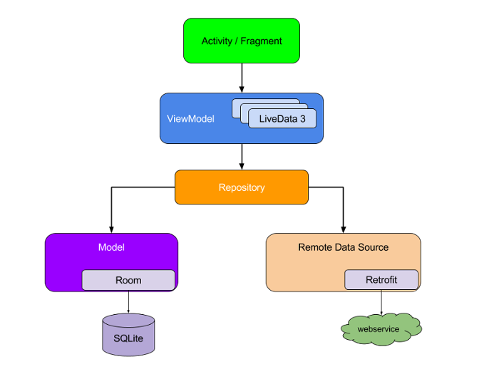

# Test Application for Snapp Market

This app is a simple news app, which use from [newsapi](https://newsapi.org) API to fetch news. this app uses the Architecture components, Dagger etc in Kotlin.

## Outputs

 

## Libraries and tools 🛠
- [Navigation](https://developer.android.com/topic/libraries/architecture/navigation/)   
- [ViewModel](https://developer.android.com/topic/libraries/architecture/viewmodel)   
- [LiveData](https://developer.android.com/topic/libraries/architecture/livedata)   
- [Data Binding](https://developer.android.com/topic/libraries/data-binding)   
- [RoomDB](https://developer.android.com/topic/libraries/architecture/room)   
- [RxJava](https://github.com/ReactiveX/RxJava)   
- [RxAndroid](https://github.com/ReactiveX/RxAndroid)   
- [RxKotlin](https://github.com/ReactiveX/RxKotlin)   
- [Dagger 2](https://github.com/google/dagger)   
- [Retrofit](https://square.github.io/retrofit/)   
- [OkHttp](https://github.com/square/okhttp)   
- [Glide](https://github.com/bumptech/glide)   
- [Material Design](https://material.io/develop/android/docs/getting-started/)   

## Architecture
The app uses MVVM [Model-View-ViewModel] architecture to have a unidirectional flow of data, separation of concern, testability, and a lot more.

